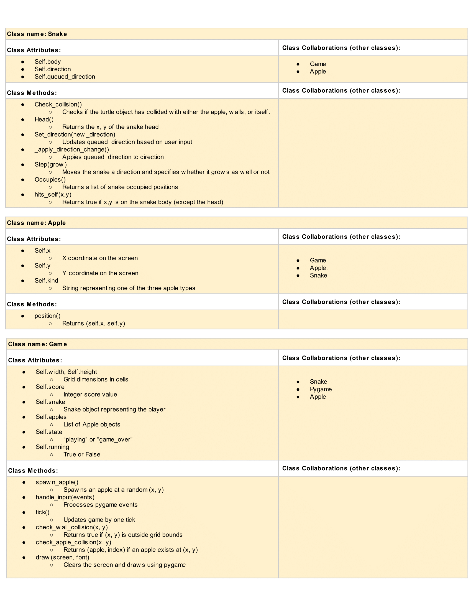

# CSC226 Final Project

## Instructions

**Author(s)**: Pier Ciccariello and Yoseph Alemu

**Google Doc Link**: [https://docs.google.com/document/d/1xbB0G9bZFdgToJuu1stKl51P61zEk0EGotOB9yKa5Ds/edit?usp=sharing](https://docs.google.com/document/d/1xbB0G9bZFdgToJuu1stKl51P61zEk0EGotOB9yKa5Ds/edit?pli=1&tab=t.0#heading=h.qg98s23ap4mh)

**Github Link**:[ https://github.com/Berea-College-CSC-226/p01-final-project-ciccariellop-alemuy](https://docs.google.com/document/d/1xbB0G9bZFdgToJuu1stKl51P61zEk0EGotOB9yKa5Ds/edit?pli=1&tab=t.0#heading=h.qg98s23ap4mh)

Communication Plan:

**How will you communicate**: Phone/texting
**When will you meet in person?**: Sunday @ 5PM
**How responsive should your partner expect you to be?**: Responsive but independent
---

## Milestone 1: Setup, Planning, Design

**Title**: `Snake++`

**Purpose**: `This project recreates and expands upon earlier Turtle assignments T03 by building an interactive Snake
                Game with varieties of food elements. The player controls a snake that moves around the screen, eats food (including normal apple, spoiled apple, and golden apple) to grow, and must 
                avoid collision with the wall to survive`

**Source Assignment(s)**: `T03 – Boustrophedon Turtle Drawing (movement, direction, and drawing logic reused)
                             Class examples using Turtle/Pygame for motion and user input.`

**CRC Card(s)**:

 "Image of CRC card. ")

**Branches**: This project will **require** effective use of git. 

```
    Branch 1 starting name: alemuy
    Branch 2 starting name: ciccariellop
```

### References 

T03 – Boustrophedon Turtle Drawing
T12 - Events and GUIs
---

## Milestone 2: Code Setup and Issue Queue

Reflect on what you’ve done so far. How’s it going? Are you feeling behind/ahead? What are you worried about? 
What has surprised you so far? Describe your general feelings. Be honest with yourself; this section is for you, not me.

```
    The project is going alright so far. I don’t feel behind, but I’m not really ahead either.
    The planning took longer than I expected and some parts like thinking through collisions
    worry me a bit. But breaking everything into smaller tasks has helped a lot and I feel more
    organized than I thought I would. Overall, I’m a little nervous but mostly confident I can
    get it done.
```

---

## Milestone 3: Virtual Check-In

Indicate what percentage of the project you have left to complete and how confident you feel. 

Completion Percentage: `47%`

Confidence: Describe how confident you feel about completing this project, and why. Then, describe some 
  strategies you can employ to increase the likelihood that you'll be successful in completing this project 
  before the deadline.

```
Right now, I’m not completely sure how confident I feel about finishing the project on time. I’ve made some progress, 
but there is still a lot left to do, and working with one hand because of my broken finger has definitely slowed me down. 
I’m unsure how quickly I can complete the remaining parts, but I will do my best to finish it on time.
```

---

## Milestone 4: Final Code, Presentation, Demo

### User Instructions

In a paragraph, explain how to use your program. Assume the user is starting just after they hit the "Run" button 
in PyCharm. 

First, you click the run button on the main.py file while on the IDE, or wherever you are starting the snake game from. Once you run the file, a window will pop up. In the window, you will be prompted for your name. Type it in and then press enter to start the game. Once you are in the game, you may move the snake character with W A S D or the arrow keys. 

### Errors and Constraints

Every program has bugs or features that had to be scrapped for time. These bugs should be tracked in the issue queue. 
You should already have a few items in here from the prior weeks. Create a new issue for any undocumented errors and 
deficiencies that remain in your code. Bugs found that aren't acknowledged in the queue will be penalized.

### Reflection

Each partner should write three to four well-written paragraphs address the following (at a minimum):
- Why did you select the project that you did?
- How closely did your final project reflect your initial design?
- What did you learn from this process?
- What was the hardest part of the final project?
- What would you do differently next time, knowing what you know now?
- How well did you work with your partner? What made it go well? What made it challenging?

```
    Partner 1: Pier
    
    I chose the snake game to suggest to Yoseph because I played it a lot since I was younger, especially during COVID. The final project reflects the initial idea very well, with only minor deviations. 
    I learned a lot from this process about coding, working on projects, and with different perspectives. The hardest part was definitely bringing myself to do the coding after breaking down the subtasks. After starting to code, it was much better. 
    The momentum helped me continue. Next time, I may choose a different game with different constraints to challenge myself. Additionally, I'd schedule more time to have in-person collaboration with my partner, rather than working as much in individual segments. Working with my partner went well overall. It was challenging because of our different schedules, priorities, and Yoseph injuring his hand. 
    Despite all of this, I feel we were able to do our respective parts to make it work. 
```

```
Partner 2: Yoseph

I chose to work on the Snake game because it allowed me to combine creativity with the core programming concepts we 
learned in class, such as classes, event handling, and game logic. The final project stayed very close to our original 
design, with added features like different apple types, special effects, and a start menu that made the game more interactive. 
Through this project, I learned how to better structure a larger program, manage state in a game, and debug issues incrementally. 
The hardest part was pacing the work and making steady progress, especially while working with one hand due to my injury. 
If I were to do this project again, I would start testing earlier and plan visual features sooner. Working with my partner went well overall 
clear division of subtasks helped us stay organized, even when coordination was challenging.

```

---